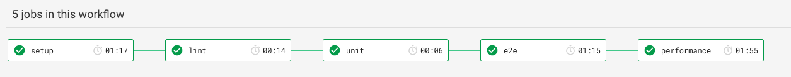
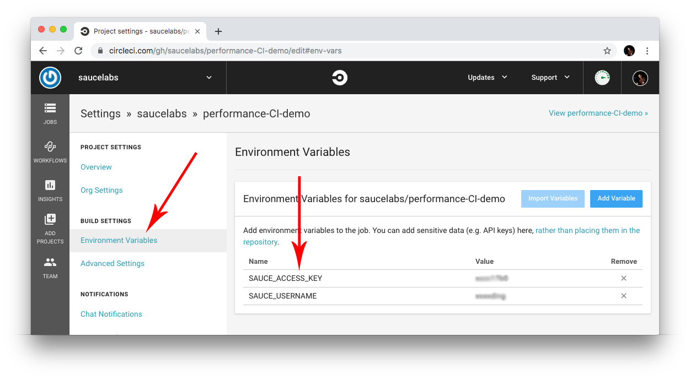
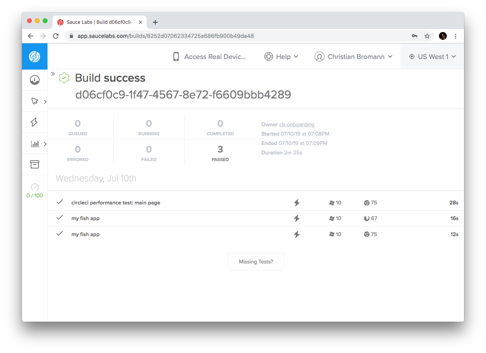
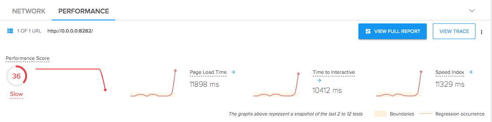
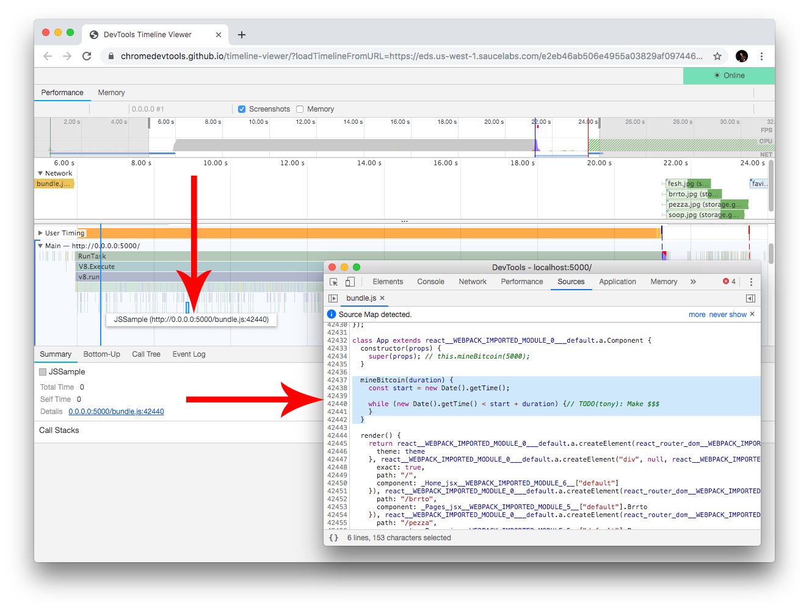

Sauce Performance CI Boilerplate
================================

This repository contains an example project that demonstrates how to use [Sauce Performance](https://saucelabs.com/products/web-testing/sauce-performance-testing) in an CI environment using [CircleCI](https://circleci.com/). The application under test is written using [React](https://reactjs.org/) but the approach can be applied to any other frontend framework (e.g. AngularJS or Ember). The demo pipeline contains next to the usual steps like building, linting, unit and e2e tests another final checkpoint for testing the performance of the app. The workflow in CircleCI is architected as followed:



Let's walk through it step by step and understand how to apply an additional performance step than assures the stability of our frontend performance. If you have questions on CircleCI and their workflow pipeline have a look into their [documentation](https://circleci.com/docs/2.0/getting-started/#section=getting-started). The same setup can be applied to other CI/CD tools like Jenkins or Travis.

Fork the project and register a free-trial account at [Saucelabs](https://saucelabs.com/signup/trial) to play around we the example and adapt it to your own project.

## Environment Variables

This project uses [Sauce Labs](https://saucelabs.com) for their e2e as well as Performance testing. In order to authenticate with the cloud we stored the `SAUCE_USERNAME` and `SAUCE_ACCESS_KEY` variables in the environment if the project using the CircleCI interface. These are being picked up by the frameworks we use in this demo:



### Setup Project

In this step we want to setup and build our project so that we can serve it for our tests that come in the next steps. Since our project uses Node.js we can use the common Node.js Docker image to build our files. The job looks as simple as follows:

```yaml
setup:
  docker:
    - image: circleci/node:10.12
  steps:
    - checkout
    - run:
        name: Install Dependencies
        command: npm install
    - run:
        name: Build Project
        command: npm run build
    - persist_to_workspace:
        root: .
        paths:
          - .
```

_Note:_ at the end of the step we persist our current path to our workspace. That will allow us to reuse our build files in the next steps.

### Linting, Unit and e2e Testing

The next three steps are pretty simple and straightforward and might differ to your project. These are steps to ensure that our code is properly formated, that our code is tested as well as all functional aspects of our application are checked from end to end. The jobs us preconfigured NPM commands so that the CircleCI config stays simple:

```yaml
lint:
  docker:
    - image: circleci/node:10.12
  steps:
    - attach_workspace:
        at: .
    - run:
        name: Linter
        command: |
          npm run test:lint
unit:
  docker:
    - image: circleci/node:10.12
  steps:
    - attach_workspace:
        at: .
    - run:
        name: Unit Tests
        command: |
          npm run test:unit
e2e:
  docker:
    - image: circleci/node:10.12
  steps:
    - attach_workspace:
        at: .
    - run:
        name: Functional Tests
        command: |
          npm run test:sauce
```

The unit tests use the [Jest](https://jestjs.io/) framework. A popular unit test framework especially for React applications. All functional tests are written with [WebdriverIO](https://webdriver.io/). Both unit and e2e test are highly simplified and should demonstrate how they can be setup.

_Note:_ we attach our build files every time to our jobs so that we can make use them for our testing purposes. It is important to attach the following to the job config to make this happen:

```yaml
- attach_workspace:
    at: .
```

### Performance Testing

Last but not least we want to test the performance of our application. It is important that this is the last step of our setup. Only if our unit as well as our functional tests are all passing we want to run this check. If either of these checks fail our pipeline should fail early so that we get notified quickly. In addition to that a performance test expects that the application is functional correct as we are testing the experience of the user. We are not interested in the performance of a failing application.

The performance job uses [Speedo](https://www.npmjs.com/package/speedo) as CLI tool in order to test the performance of the page load of our application. The tool is released as a Docker image at Docker Hub. In order to use it in CircleCI or any other CI/CD pipeline just define `saucelabs/speedo` as your base image. With this you have access to the `speedo` command.

```yaml
performance:
  docker:
    - image: saucelabs/speedo:next
  steps:
    - attach_workspace:
        at: .
    - run:
        name: Test Main Page
        command: |
          npm i n
          npx http-server -p 8282 ./build 2>&1 >> static-server.log &
          speedo run http://localhost:8282 \
            -n "performance test: main page" \
            -b $CIRCLE_WORKFLOW_ID \
            -i perf-tunnel-main
```

In order to allow Sauce Labs to access my build application in the pipeline we need to:

1. serve the application using a static server
2. use [Sauce Connect Proxy](https://wiki.saucelabs.com/display/DOCS/Sauce+Connect+Proxy) to allow the VM in the cloud to access my network using a secured tunnel

In this example we use the [`http-server`](https://www.npmjs.com/package/http-server) as simple static server. If your application has a backend that serves the app you can as well just start the backend server. In the Speedo command we then apply `-i perf-tunnel-main` as parameter to tell the tool to start a secure tunnel. We then can open `http://localhost:8282` in our performance test to check if our application loads as expected.

## Run Tests for the first time

If we now run the pipeline for the first time, no performance information are being captured so far. Therefor the Sauce Performance feature needs to run a few tests to learn about the performance of the app. The Speedo output in our last job will look as follows:

```
✔ Start performance test run with user cb-onboarding on page http://localhost:8282...
✔ Started Sauce Connect tunnel with identifier "perf-tunnel-main"
✔ Couldn't find baseline for job with name "performance test: main page", creating baseline...
✔ Run performance test...
✔ Wait for job to finish...
✔ Download performance logs...
✔ Updating job status...
✔ Stopping Sauce Connect tunnel...
📃 Stored performance logs in /tmp/tmp-53Jv6tlhbaEkRb

Performance Results
===================
score: 35/100
estimatedInputLatency: 16ms
timeToFirstByte: 638ms
domContentLoaded: 10.4s
firstVisualChange: 10.5s
firstPaint: 10.5s
firstContentfulPaint: 10.5s
firstMeaningfulPaint: 10.5s
lastVisualChange: 12s
firstInteractive: 10.5s
load: 12s
speedIndex: 11.5s

Result: pass ✅

⚙️  Runtime settings:
- Network Throttling: Good 3G
- CPU Throttling: 4x
- CPU/Memory Power: 301 (high-end mobile phone)
- User Agent: Mozilla/5.0 (Windows NT 10.0; WOW64) AppleWebKit/537.36 (KHTML, like Gecko) Chrome/75.0.3770.80 Safari/537.36

👀 Check out job at https://app.saucelabs.com/performance/789966a979b94ba288daeae9d1348782/0
```

As this is our first test and a new fresh baseline was created our performance test passes as expected. By default Speedo is testing the [Lighthouse Performance Score](https://developers.google.com/web/tools/lighthouse/) but you can define which metrics you want to test by applying one or many `-m <metric_name>` parameter to the `speedo run` call. At your [saucelabs.com](https://app.saucelabs.com/dashboard/builds) dashboard you will see a build with the CircleCI build number appearing containing both e2e tests as well as the performance test:



## A Performance Problem was introduced

Let's run through a scenario where a performance problem was introduced by a patch via pull request. Once we have connected our VCS tool (e.g. GitHub) with CircleCI or a different CI/CD tool the pipeline is being kicked off once a PR is proposed. In our patch we have introduced a performance problem by commenting in the `mineBitcoin` function that is causing the main thread of the browser to block before displaying the page:

```js
// see /src/App.jsx

class App extends React.Component {
  constructor(props) {
    super(props);
    this.mineBitcoin(5000);
  }
  // ...
}
```

This change will cause our app to load 5s slower. In our pipeline we see that linting, unit as well as our e2e tests are passing. However the performance test failing due to:

```
Performance assertions failed! ❌
Expected score to be between 34/100 and 38/100 but was actually 23/100
```

The patch introduced a drop in the Lighthouse Performance Score so that the value is outside of our expected range. Looking into the [Sauce Labs Job Details Page](https://app.saucelabs.com/tests/8947e56b55194fc395c33f338802d7e0) we now see, when we open the Performance Tab, that all metrics have spiked up:



If we open the full report we get all insights about the metrics that were captured and can see that the whole page just loaded 5 seconds slower. With Sauce Performance we are now able to inspect the trace by clicking the `View Trace` button on the top left of the page. The DevTools Timeviewer App is being opened and shows us all processes that the browser was running during that page load. If we inspect the time where we expect the page to load we see that one function is being executed all over again and is blocking the main thread from anything else:



If we use the DevTools to inspect the app at the given line we see that it points us directly to the `mineBitcoin` function where the performance problem originates. Of course, this is a simplified example but it shows that with Sauce Performance you can test the performance of your application in an arbitrary CI/CD environment.
